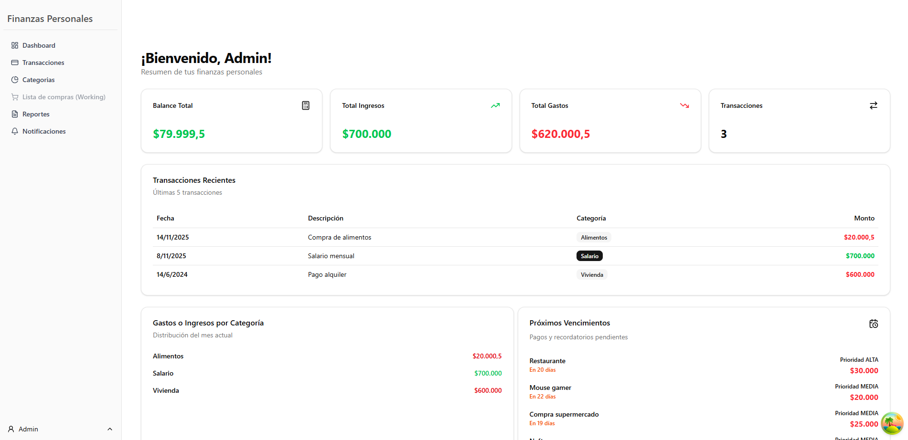

# Sistema de Gestión de Finanzas Personales - Backend

---

#### Descripción general

API para gestión de finanzas personales, incluye generación de usuarios,
transacciones, notificaciones y generación de informes. Desarrollada con
Node.js, Express y TypeScript, aplicando una arquitectura MVC incluyendo una
capa de servicios.

---

#### Tecnologías utilizadas

- **Lenguaje**: Typescript
- **Framework**: Express.js
- **ORM**: Prisma
- **Base de datos**: PostgreSQL
- **Validaciones**: Zod
- **Autenticación**: JWT (jsonwebtoken)
- **Exportación de Archivos**: pdfmake, exceljs
- **Linting**: Biomejs
- **Testing**: Vitest

---

#### Requisitos previos

- [Node.js 18+](https://nodejs.org/es/download)
- [Biome IDE extensión](https://biomejs.dev/guides/editors/first-party-extensions/)
- [Prisma IDE extensión](https://www.prisma.io/docs/orm/more/development-environment/editor-setup)

---

#### Instalación

1. Clonar el repositorio

```bash
git clone https://github.com/Bara1422/FinanzasPersonalesBack.git
cd FinanzasPersonalesBack
```

2. Instalar dependencias

```bash
npm install
```

3. Configurar variables de entorno (_**.env**_) Crear un archivo **.env** en la
   raiz del proyecto basandose en el **.env.example**
   ```javascript
   JWT_SECRET=your_jwt_secret_here
   JWT_EXPIRES_IN=1d
   NODE_ENV=development
   PORT=3000
   DATABASE_URL=
   CORS_ORIGIN=
   ```

4. Generar codigo cliente de Prisma para tipado estricto en TypeScript

```bash
npm run prisma:generate
```

5. Ejecutar la seed de Prisma para restablecer la base de datos a unos valores
   iniciales

```bash
npm run prisma:seed
Al correr el comando se le preguntará si desea resetar la base de datos. 
 Are you sure you want to reset your database? All data will be lost.

 Apretar "Y"
```

6. Ejecutar la API en desarrollo

```bash
npm run dev
```

7. Realizar las consultas en Postman mediante la coleccion proporcionada,
   ingresar el token obtenido en el login o register en los headers de
   Authorization de Postman.

---
 Para mejor experiencia conectar con el frontend
[Finanzas Personales Frontend](https://github.com/Bara1422/FinanzasPersonalesFront/tree/dev)


---

#### Estructura del proyecto

```bash
/prisma                   # Prisma Schema y migracioens
/src
 ├── config/              # Configuraciones de envs y bcrypt
 ├── controllers/         # Controladores de cada recurso
 ├── db/                  # Configuracion prisma y seed
 ├── dtos/                 # Data Transfer Objects
 ├── middlewares/         # Autenticación, validación, user-rol, errores
 ├── repositories/        # Repositorios separados en Mock y Prisma
 ├── routes/              # Definición de rutas Express
 ├── schemas/             # Validaciones Zod
 ├── services/            # Lógica de negocio
 ├── types/               # Tipado TypeScript
 ├── utils/               # CustomError, Excel y PDF exporters
 ├── app.ts               # Configuracion express
 └── index.ts             # Entrypoint del servidor
/test                     # Tests
```

---

#### Patrones aplicados

##### Singleton

```typescript
// /src/config/bcrypt.ts

import { compareSync, hashSync } from "bcrypt";

export class BcryptAdapter {
   private static instance: BcryptAdapter;
   private saltRounds: number = 10;
   private constructor() {}

   public static getInstance(): BcryptAdapter {
      if (!BcryptAdapter.instance) {
         BcryptAdapter.instance = new BcryptAdapter();
      }
      return BcryptAdapter.instance;
   }

   hash(password: string): string {
      return hashSync(password, this.saltRounds);
   }

   compare(password: string, hashedPassword: string): boolean {
      return compareSync(password, hashedPassword);
   }
}
```

Se usa en el RepositoryFactory, tambien en el user.data.ts para hashear las
contraseñas y en los test del usuario Elegimos implementar un singleton en vez
de crear una instancia cada vez que se utilice, ya que los valores iban a ser
iguales en todos los lugares y no requeria cambios de un archivo a otro.

##### Factory Method

```typescript
// /src/services/reportes/factories

// ReportFormatFactory
export class ReportFormatFactory {
   static create(format: FormatoReporte) {
      switch (format) {
         case "pdf":
            return new PDFReportFormat();
         case "excel":
            return new ExcelReportFormat();
         default:
            throw new Error(`Formato de reporte no soportado: ${format}`);
      }
   }
}

//  ReportTypeFactory
export class ReportTypeFactory {
   static getReportType(type: TipoReporte): IReportType<ReportData> {
      switch (type) {
         case "usuario":
            return new UserReport();
         case "transacciones":
            return new TransactionsReport();
         case "categorias":
            return new CategoriesReport();
         case "notificaciones":
            return new NotificationsReport();
         case "todos_usuarios":
            return new AllUsersReport();
         default:
            throw new Error("Tipo de reporte no soportado");
      }
   }
}
```

Los reportes se pueden crear de distintos tipos y en distintos formatos, por eso
decidimos usar el patron Factory Method para desacoplar el servicio de reporte
de toda la logica de creacion del reporte en sí. Asi, pasandole un argumento a
la funcion cambia totalmente o el formato del reporte o el tipo de reporte
permitiendo que sea facilmente extendible.

##### Strategy

```typescript
// /src/services/reportes/strategies/formatReport

// ExcelReportFormat
export class ExcelReportFormat implements IReportFormat<ReportData> {
   async export(data: ReportData[], title: string): Promise<Buffer> {
      return await excelGenerator(data, title);
   }
}

// PDFReportFormat
export class PDFReportFormat implements IReportFormat<ReportData> {
   async export(data: ReportData[], title: string): Promise<Buffer> {
      return await pdfGenerator(data, title);
   }
}
```

Cada una utiliza el mismo método pero lo ejecutan con distintas funciones

```typescript
// /src/services/reportes/factories

export class ReportFormatFactory {
   static create(format: FormatoReporte) {
      switch (format) {
         case "pdf":
            return new PDFReportFormat();
         case "excel":
            return new ExcelReportFormat();
         default:
            throw new Error(`Formato de reporte no soportado: ${format}`);
      }
   }
}
```

El factory es el que se encarga de elegir la Strategy segun el parametro que
reciba

```typescript
// /src/services/reportes/report.service.ts

export class ReportService {
   static async generateReport(
      type: TipoReporte,
      format: FormatoReporte,
      id_usuario: number,
   ) {
      const dataStrategy = ReportTypeFactory.getReportType(type);
      if (!dataStrategy) {
         throw new CustomError(`Tipo de reporte inválido ${type}`, 400);
      }

      const { data, title } = await dataStrategy.generar(id_usuario);

      const formatStrategy = ReportFormatFactory.create(format);
      if (!formatStrategy) {
         throw new CustomError(`Formato de reporte inválido ${format}`, 400);
      }

      return await formatStrategy.export(data, title);
   }
}
```
Y el service es donde se pasan los parametros para decidir que estrategia usar

Elegimos Strategy porque nos permite haces que el report.service solo se encargue de llamar a export sin condicionales, dejando que el ReportFormatFactory y el ReportTypeFactory sean los que, en base al parametro que recibieron, elegir la estrategia.

##### Facade
```typescript
class Seed {
  private usuarios: Usuario[] = [];
  private categorias: Categoria[] = [];
  private transacciones: Transaccion[] = [];
  private notificaciones: Notificacion[] = [];

  constructor(private prisma: PrismaClient) {}

  async clearDB(): Promise<void> {...}

  async seedUser(): Promise<void> {...}

  async seedCategories(): Promise<void> {...}

  async seedTransactions(): Promise<void> {...}

  async seedNotifications(): Promise<void> {...}

  async seedAll(): Promise<void> {
    await this.clearDB();
    await this.seedUser();
    await this.seedCategories();
    await this.seedTransactions();
    await this.seedNotifications();
    console.log("Seed completado.");
  }
}

async function main() {
  const seeder = new Seed(prisma);
  await seeder.seedAll();
}

main()
  .then(async () => {
    await prisma.$disconnect();
  })
  .catch(async (e) => {
    console.error(e);
    await prisma.$disconnect();
    process.exit(1);
  });
```
Decidimos usar facade para simplificar la inicialización de los datos iniciales de la BDD, usando un solo método de la clase Seed, que engloba a la creacion de usuarios, categorías, transacciones y notificaciones

---

##### Integrantes

- Ismael Cordoba
- Mariana Baradad
- Juan Baranovsky
- Francisco Rios
- Hernan Folik

##### TeamLeader :

- Juan Baranovsky
